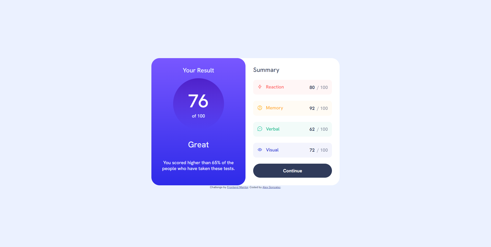
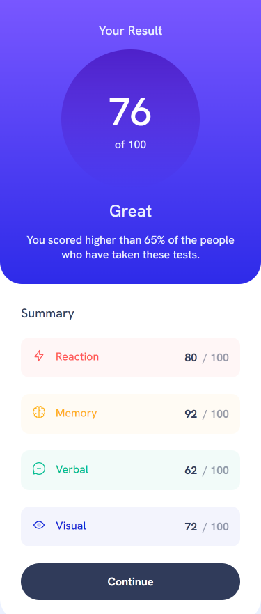

# Frontend Mentor - Results summary component solution

This is a solution to the [Results summary component challenge on Frontend Mentor](https://www.frontendmentor.io/challenges/results-summary-component-CE_K6s0maV). Frontend Mentor challenges help you improve your coding skills by building realistic projects.

## Table of contents

- [Frontend Mentor - Results summary component solution](#frontend-mentor---results-summary-component-solution)
  - [Table of contents](#table-of-contents)
  - [Overview](#overview)
    - [The challenge](#the-challenge)
    - [Screenshot](#screenshot)
      - [Desktop Version](#desktop-version)
      - [Mobile Version](#mobile-version)
    - [Links](#links)
  - [My process](#my-process)
    - [Built with](#built-with)
    - [What I learned](#what-i-learned)
    - [Continued development](#continued-development)
  - [Author](#author)

## Overview

### The challenge

Users should be able to:

- View the optimal layout for the interface depending on their device's screen size
- See hover and focus states for all interactive elements on the page

### Screenshot

#### Desktop Version



#### Mobile Version



### Links

- Solution URL: [Github Repo](https://github.com/luinrandir/results-summary-component)
- Live Site URL: [Github Live](https://luinrandir.github.io/results-summary-component)

## My process

### Built with

- Semantic HTML5 markup
- CSS custom properties
- Flexbox
- CSS Grid
- Mobile-first workflow

### What I learned

The biggest thing I learned from this challenge was to really focus on mobile first design. So far when I have been working on challenges or self-studying projects, I never gave thought about mobile first design. As I have started to feel a bit more comfortable with HTML and CSS I am starting to focus more on mobile first. The biggest thing I was proud of is the following code.

```css
/*Media Queries*/
@media (width > 600px) {
  body {
    font-size: var(--fs-medium);
    place-content: center;
  }
  .results {
    grid-template-columns: 1fr 1fr;
  }

  .score {
    border-radius: var(--box-radius-size);
  }
  .card-label {
    font-size: var(--fs-medium-2);
  }
  .score-total {
    font-size: var(--fs-xlarge-2);
  }
  .score-results {
    font-size: var(--fs-large);
  }
}
```

If I would have approached this challenge as I have other projects, then I would have made multiple classes trying to get the layout correct. However, when focusing to make the main layout work for mobile, I quickly realized that only a few items really needed to change. Other CSS attributes did not need to be re-adjusted or tinkered with to make the magic happen.

### Continued development

Thanks to this challenge I really am aiming to put myself in the mindset of mobile first design. In a previous personal project I used TailwindCSS with some mobile first design in mind, yet strayed away from it. After some reflection, I have come to the conclusion that if I were to have focused more on mobile first with the TailwindCSS project, it would have saved quite a bit of time.

## Author

- Frontend Mentor - [@luinrandir](https://www.frontendmentor.io/profile/luinrandir)
- Github - [@luinrandir](https://github.com/luinrandir)
